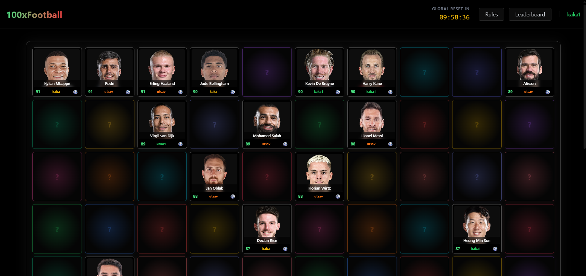
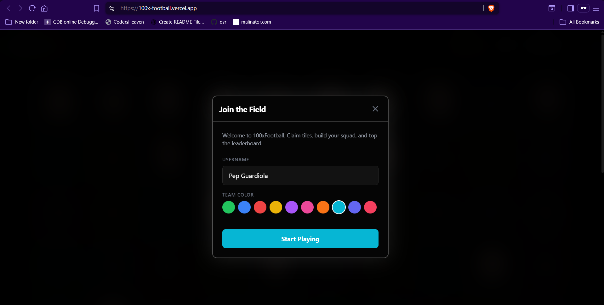
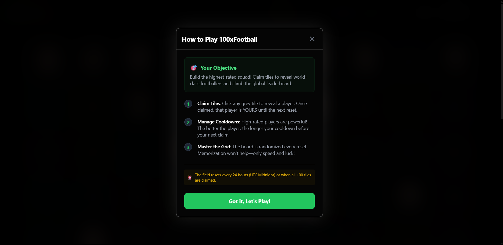
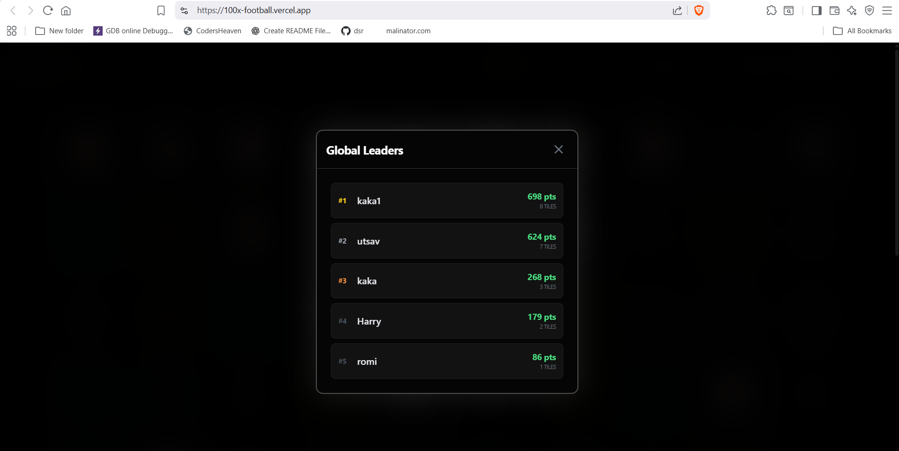

# 100xFootball 🏟️

100xFootball is a real-time, competitive footballer-claiming game. Strategy meets speed as managers compete to build the highest-rated squad from a randomized grid of world-class players.



## ⚽ The Concept

The game board consists of 100 tiles, each hiding a top-rated footballer. Managers must click to reveal and claim players. Once a tile is claimed, that player is locked to the manager's squad until the next global reset.

### Key Game Mechanics:
- **Real-time Reveal**: Every tile claim is synchronized across all users instantly using Supabase Realtime.
- **Dynamic Cooldowns**: Claiming higher-rated players (like Messi or Mbappe) triggers longer cooldown periods, forcing managers to choose between high-value targets or rapid-fire reveals.
- **Global Leaderboard**: Track scores based on the total 'Overall' rating of your claimed squad.
- **24h Global Reset**: The board is cleared every 24 hours (UTC Midnight) or when all 100 tiles are claimed, resetting the race for glory.

## 🛠️ Tech Stack

### Frontend
- **React + Vite**: High-performance development and bundling.
- **Tailwind CSS**: Custom "Gotham Edition" dark theme with glaring high-contrast borders and glassmorphism.
- **Supabase Realtime**: Powers the live flip animations and claim notifications across all connected clients.

### Backend
- **Node.js & Express**: Robust API handling the core game logic (cooldowns, user profiles, tile management).
- **Supabase (PostgreSQL)**: Reliable data persistence and real-time database listeners.
- **Node-cron**: Manages automated board resets and scheduled tasks.

## 📸 Screenshots

````carousel

<!-- slide -->

<!-- slide -->

````

## 🚀 Getting Started

### Prerequisites
- Node.js (v18+)
- Supabase Project (URL and Anon Key)

### Local Setup

1. **Clone the repository**
   ```bash
   git clone <repository-url>
   cd 100xFootball
   ```

2. **Backend Configuration**
   ```bash
   cd backend
   npm install
   ```
   Create a `.env` file in the `backend` folder:
   ```env
   PORT=4000
   SUPABASE_URL=your_supabase_url
   SUPABASE_KEY=your_supabase_service_role_key
   ```
   Run the database seeder:
   ```bash
   npm run seed
   npm run dev
   ```

3. **Frontend Configuration**
   ```bash
   cd ../frontend
   npm install
   ```
   Create a `.env` file in the `frontend` folder:
   ```env
   VITE_SUPABASE_URL=your_supabase_url
   VITE_SUPABASE_ANON_KEY=your_supabase_anon_key
   VITE_API_URL=http://localhost:3000/api/v1
   ```
   Launch the application:
   ```bash
   npm run dev
   ```

## 🏗️ Project Structure

```text
├── backend
│   ├── src
│   │   ├── controllers    # API Request handlers
│   │   ├── services       # Core logic (Reset, Tile management)
│   │   ├── routes         # Express modular routing
│   │   └── utils          # Cooldown calculations
├── frontend
│   ├── src
│   │   ├── components     # Modular UI (Tiles, Modals, Header)
│   │   ├── lib            # Supabase configuration
│   │   └── App.jsx        # Main game logic and state
```

---
Built by Utsav
